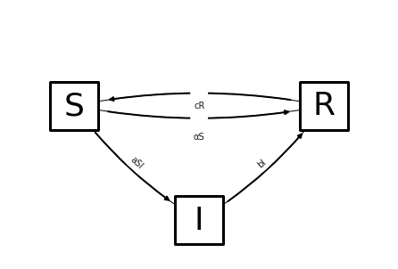
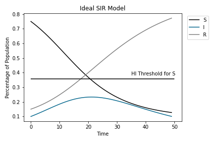

# TEAM MAGIC 8 BALL

---
## Team Members
- [David Cherney](https://www.linkedin.com/in/dmcherney/)
- [Shania Thomas](https://www.linkedin.com/in/shania-thomas-atx22/)
- [Thomas Prich](https://www.linkedin.com/in/thomas-prich/)
- [Afolabi Cardoso](https://www.linkedin.com/in/afolabi-cardoso/)

---
## Content

[Problem Statement](#Problem-Statement) | [Data](#DATA) | [Methodology](#Methodology) | [Conclusions and Recommendations](#Conclusions-and-Recommendations)

---

##  Problem Statement

Do generic times series models, or dynamics specific models provide the best next day predictions of COVID case load for a population?

### Background
<a href="https://en.wikipedia.org/wiki/Autoregressive_integrated_moving_average">ARMIMA models</a> are a general tool for time series prediction that take into account past trends in a variety of ways. <a href="https://en.wikipedia.org/wiki/Compartmental_models_in_epidemiology#The_SIR_model_without_vital_dynamics">SIR models</a> by contrast, aim to model the dyanamics of spead of disease in a finite population. By comparing SIR and ARIMA models using national COVID-19 data from the CDC, we want to determine if SIR or ARIMA is a better predictor of new COVID-19 infections.

The Federal Department of Health has put together a team of data scientist to help investigate the Covid-19 outbreak in 2020 and 2021. By comparing the SIR model and ARIMA model with the actual data for each state, we look to determine if the SIR model over predicts the total number of Covid cases.

---
## DATA

[United States COVID-19 Cases and Deaths by State over Time](https://data.cdc.gov/Case-Surveillance/United-States-COVID-19-Cases-and-Deaths-by-State-o/9mfq-cb36)

[Population data from census.gov](https://www.census.gov/data/datasets/time-series/demo/popest/2010s-state-total.html#par_textimage_1873399417)

---
## Methodology

### Overview
---
#### 1) SIR model:

##### 1.1) Introducing Variables and Parameters

SIR models provide a theoretical framework for the time rates of change of three populations in an outbreak of a contageous disease. The populations in the model are given the shorthand 
- $S$ for the number of people in the population that are suscptable to getting infected
- $I$ for the number of people that are infected
- $R$ for the people that are recovered from the disease (and are therefore imune, possibly only temporarily)
The three populations exchange members as time goes on as shown in the diagram below. For example, suscepable people become infected. The following directed graph shows the exchanges in the model with $a,~b,~c,$ and $\alpha$ as arbitary numbers. 

- $a$ is called **transmissability**
- $b$ is called **recovery rate**
- $c$ is called **deimunization rate**
- $\alpha$ is called **vaccination rate**

If, further, a vaccine is administered to $\alpha$ percent of the susceptable population each unit of time (e.g. ten percent every week) the the differential equation describing the populations becomes

$$\frac{d}{dt}\left( \begin{array}{c}S \\ I \\ R  \end{array} \right) 
= \left( \begin{array}{c}-\alpha S-aSI+cR \\ aSI -bI \\ bI-cR   \end{array} \right) . 
$$
#### 1.2) Herd Immunity
The condition for a decrease in the number of infections in time, $\frac{dI}{dt} <0$, a condition called **herd immunity**, is mathematically
$$\frac{d}{dt} I < 0 \Leftrightarrow S <\frac{b}{a}.$$

Administering a vaccine hastens the approach to herd immunituy by removing people from $S$.

The image below shows an ideal SIR evolution of an epidemic; the number of infection grows, removing people from the susceptable population, until the number of susceptable people is below herd immunity threshold. After that, the infection dies out.  

We now turn to finding reasonable values of the parameters of the SIR model. 

#### 2) Realistic values of parameters $a$ and $b$
##### 2.1) Toward Realistic $b$

In SIR models, the term $-bI$ in the differential equation
$$
\frac{dI}{dt} =  aSI - bI,
$$ 
describes the rate at which infected people move into the recovered compartment. 

It is common knowledge that a case of COVID lasts about two weeks, or 14 days. 
For this reason we use 
$$b =\frac{1}{14{\rm days}}.$$

As an example of why this is an intuitive value,
if 
$b =\frac{1}{14{\rm days}} \rm{~ and~} I=14{\rm people}$
then the number of people who recover in a day is 
$bI = 1 \frac{\rm person}{\rm day}.$

##### 2.2) Toward realistic $a$
##### 2.2.1) Introducing Reproductive Number Through Exponential Models 

SIR models are improvements upon expontial models in that 
- exponential models treat the susceptable population as infinitely large, 
- SIR models take into account that the susceptable population is finite and changes size. 

In an exponential growth model of disease transmission each infected person, over the duration of their infection, infects some number of susceptable people. This number is called **the reproductive number** of the disease. 

**If the reproductive number of a disease is less than 1 then the disease will die out.** 

To make this idea quantitative, let $b$ be the recovery rate (so $1/b$ is the durration of disease) and number $r_0$ be the reproductive number of a disease. 
The differential below above is then interpreted as "each day each infected person infects $r_0 b$ other people."

$$\frac{dI}{dt} = r_0 b  I.$$

This is called an exponential model because the solutions ($I$ as a function of time $t$) are the exponential functions of the form
$$I(t) = I_0(r_0b)^t$$
with $I(0)$ the number of infections when $t=0$. 
Changing base to Euler's number ($e$) the functions are
$$I(t) = I_0e^{\ln(r_0 b)t}.$$

The doubling time for the infection is $t_d$ such that $e^{\log(r_0 b)t_d}=2 \Rightarrow t_d = \ln(2)/\ln(r_0b).$

##### 2.2.2) Reproductive number in SIR Models
SIR models have a similar feature, the reproductive number, but the value changes in time. 

Recall that in SIR models 
$$\frac{dI}{dt} =  aSI - bI$$ 
The first term is the number of new infections per time. Compare that term to the analagous term in exponential growth models;
$$ aSI \sim r_0bI.$$
The dynamics of the two terms are different; the product $aS$ changes in time while $r_0b$ does not change in time. As a result, the exponential model grows exponentially without end, but the SIR models infections peak and then decay to 0. 

Intuitively, when almost all of the population is susceptable $S\approx p$, the growth rate of $I$ is exponential. The similarity then takes on the form 
$$ aPI \sim r_0bI \\
\Leftrightarrow 
r_0 = p\frac{a}{b}.$$
This is the reproductive number of an SIR model in terms of the transmission rate $a$, recovery rate $b$, and population $p$. 
The measured value of $r_0$ for COVID is approxinately $2.8$.
This demands that the transmission rate of covid be 
$$a =\frac{2.8 b}{p}.$$

##### 2.2.3) Effective Reproductive Rate and Herd Immunity From Another Argument

When $S$ changes to below $p$ as the infectionstarts to spread, the reproductive rate becomes an effective reproductive rate

$$
r_{{\rm eff}} = S\frac{a}{b}.
$$

The condition that the disease starts to die out 
$$
r_{\rm eff}<1 \Leftrightarrow S\lt  \frac{b}{a}
$$
as presented through different means in section 1 above. 

##### 2.3) Conclusion: Realistic Values of Parameters  $𝑎$ ,  $𝑏$ , and $p$

We conclude that 

$$
b=\frac{1}{14}\frac{\rm ppl}{\rm day},\\
a = \frac{2.8 b}{p} = \frac{0.2}{p},
$$

and that $p$ will vary between the populations we model, state, county, nation, or world. 

### 2.4) Toward Realistic $c$ 

Estimates of how long immunity to COVID lasts have been the subject of considerable research, bebate, and disagreement. We use the order of magnitude estimate of immunity lasting for about 100 days, inline with 
<a href="https://www.cnn.com/2021/10/06/health/pfizer-vaccine-waning-immunity/index.html">the estimate of three months.</a> That is, we use 
# $$ c = \frac{1}{100 {\rm\,days}}.$$

### 2.5) Toward Realistic $p$ 

We  use the the populations of each US state and Washington DC obtained from April 1st, 2020 census column in the <a href="https://en.wikipedia.org/wiki/List_of_U.S._states_and_territories_by_population">wikipedia page for US states listed by popoulation.</a>

### 2.6) Conclusion: Realistic Values of Parameters  $𝑎$ ,  $𝑏$, $c$ , and $p$

We conclude that, with units included,  

# $$b=\frac{1}{14}\frac{\rm ppl}{\rm day},~~~~a  = \frac{0.2}{p \rm \, days},~~~~c = \frac{1}{100 \rm \, days}$$

and that $p$ will vary between the state populations we model.

---
### Data Gathering and Cleaning
UsingUsing the [requests](https://docs.python-requests.org/en/latest/#) python Library,
we collected 
- cumulative number of covid cases in each state on each day in  Jan 23, 2020 to Dec 29, 2021 from [data.cdc.gov](https://data.cdc.gov/Case-Surveillance/United-States-COVID-19-Cases-and-Deaths-by-State-o/9mfq-cb36). 
- the cumulative total number of  people with completed vaccination scheduel in each day in each state from 

<<<<<<< HEAD
We collected data from multiple government sources, the bulk being from [data.cdc.gov](https://data.cdc.gov/Case-Surveillance/United-States-COVID-19-Cases-and-Deaths-by-State-o/9mfq-cb36). Using the [requests](https://docs.python-requests.org/en/latest/#) python Library, we fetched the total number of reported COVID-19 cases in all states from Jan 23, 2020 to Dec 29, 2021. We also gathered the total number of vaccinations administered from the day the vaccine was made public. This process can be seen in the notebook titled "01 data gathering and cleaning."
=======
[Click here](http://localhost:8890/lab/tree/code/01%20data%20gathering%20and%20cleaning.ipynb) to access notebook with this procedure.

>>>>>>> good mornin

---
### Data Feature Engineering

<<<<<<< HEAD
- The data gotten from [data.cdc.gov](https://data.cdc.gov/Case-Surveillance/United-States-COVID-19-Cases-and-Deaths-by-State-o/9mfq-cb36) had data on total number of people infected to date, a cumulative sum. However, for the SIR model, we needed the number of people infected _daily_. In order to get this data, we used the .diff() method on the column titled tot_cases and assigned the values to a I_actual column. We did a .diff(14) to reflect the number of days a person has an active COVID-19 infection.
=======
- The data from [data.cdc.gov](https://data.cdc.gov/Case-Surveillance/United-States-COVID-19-Cases-and-Deaths-by-State-o/9mfq-cb36) only had data on total number of people infected to date. However, for the SIR model, we needed the number of people infected daily. We engineered this feature, we used the pandas .diff(14) method on the total infected column and assigned the values to a I_actual column under the assumption that COVID cases last 14 days.
>>>>>>> good mornin

- Using the to_datetime Pandas method, we converted the submission_date column into date time format and set it as the index

<<<<<<< HEAD
- Using the states, I_actual, and total vaccinated columns, we created a new dataframe with each states currently infected numbers, and number of daily vaccinations administered as their own columns. This data is called shabang (because it made us smile in a needed time) within the data folder.
=======
- Using the states column, I_actual, and total vaccinated columns, we created a new dataframe with each states infected on each day I and vaccinated on each day V as it's own columns. 

From that from those engineered features, I and V, for each state, we ran SIR one day predictions to generate 
- the prediction I_SIR for each day in each state, 
- the prediction of number of people susceptable S_SIR in each state
- the ARIMA predicted number of infections I_arima in each state on each day.

Further, from that data we generated
- the binary feature H-I for each day in each state indicating 1 if S was herd immunity threshold on that day in that state. 

>>>>>>> good mornin

---
### Vizualizations
Click [here](https://public.tableau.com/app/profile/thomas.prich/viz/Magic8BallsGroupProject/Dashboard1) to view our tableau dashboard. 

---
## Conclusions and Recommendations

In our comparison of SIR and ARIMA models, SIR consistently overshoots the actual values. Therefore, we recommend that the Federal Department of Health use SIR more to shpw worst case scenarios, and use ARIMA for more accurate predicitions. The downside is that ARIMA's best predictions are short term. 

A possible reasons why SIR consistently overpredicts is because it does take take into account changes in behavior such as:

- Social distancing
- Remote work/school
- Masking
- Hand washing
- Reduced travel
- Closure of public places 

and other COVID-19 related precautions. These precautions very likely prevented the U.S. from reaching the infection numbers predicted by SIR. SIR also does not take into account how far apart populations are. For example, cities in rural parts of the country are less dense and therefore will have slower spread statewide comparitive to cities and states such as New York.

SIR also does not account for variants in the virus which have different rates of transmission (R0).

Based on this, SIR isn't the best for actual predictions. However, it is appropriate for predicting worst case scenarios. Next steps would include testing SIR models on time frames "medium" time frames such as 1 week, 1 month etc., and further attempting to adjust the SIR parameters to account for changes in behaviors. 

